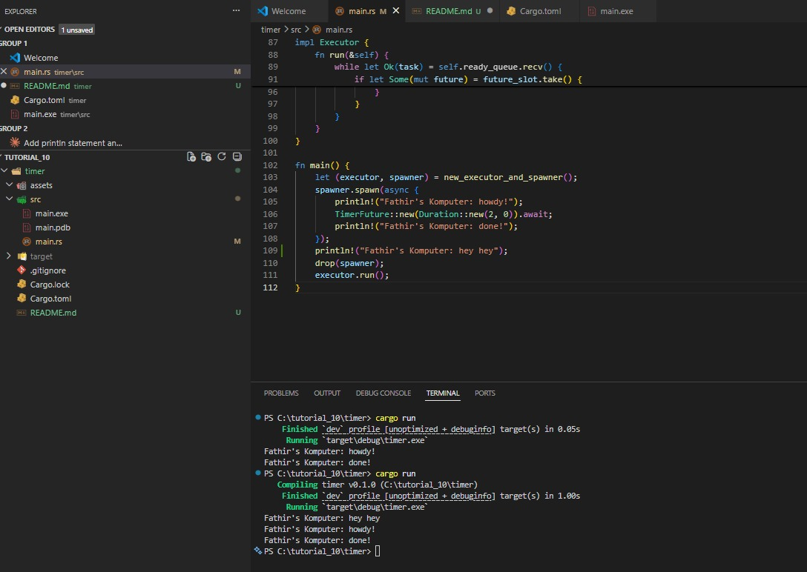
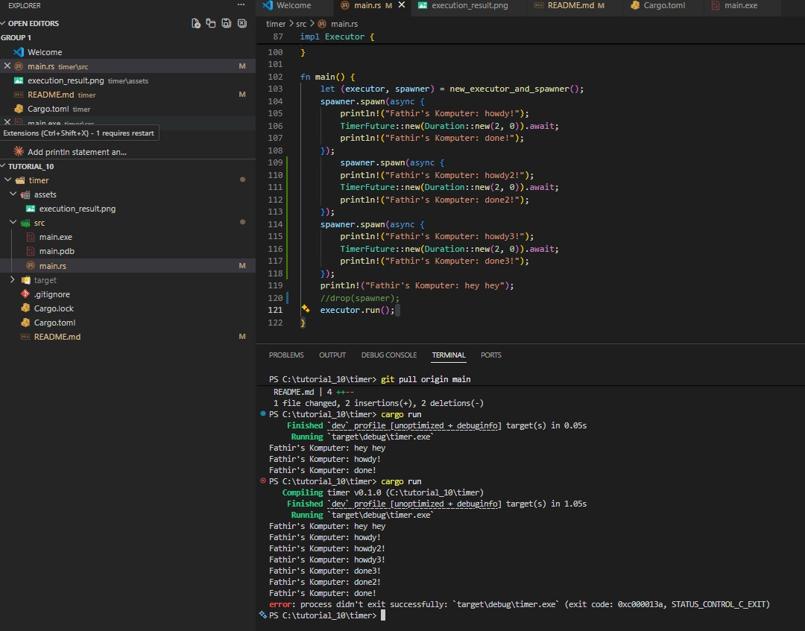
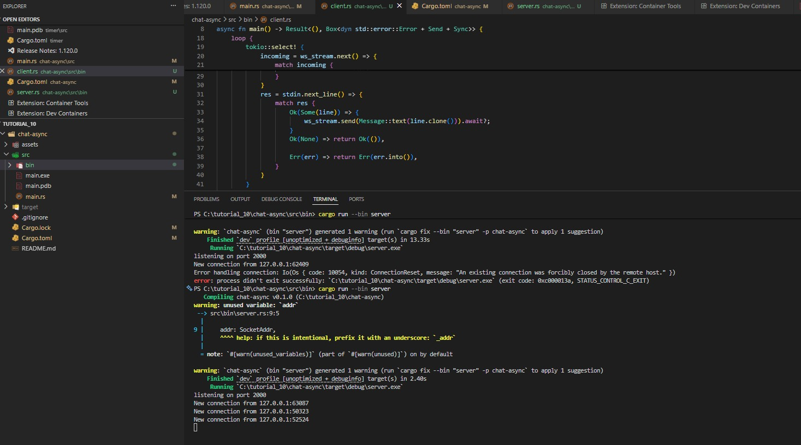
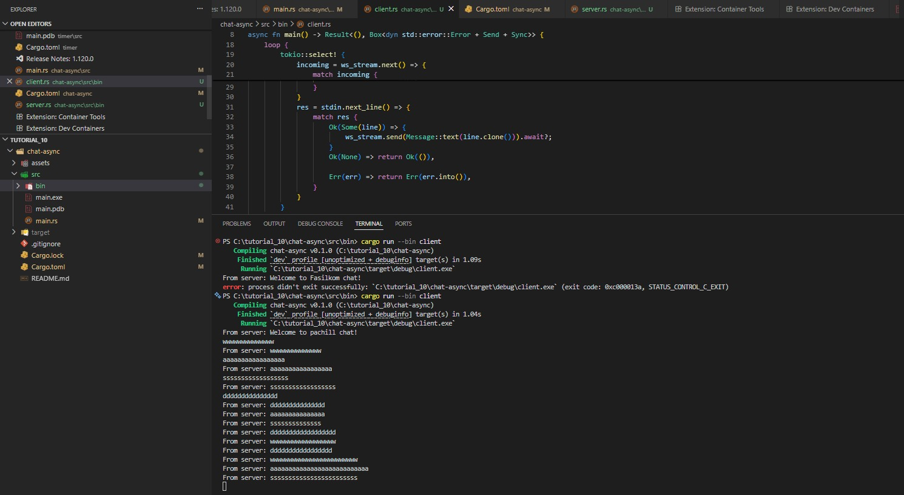
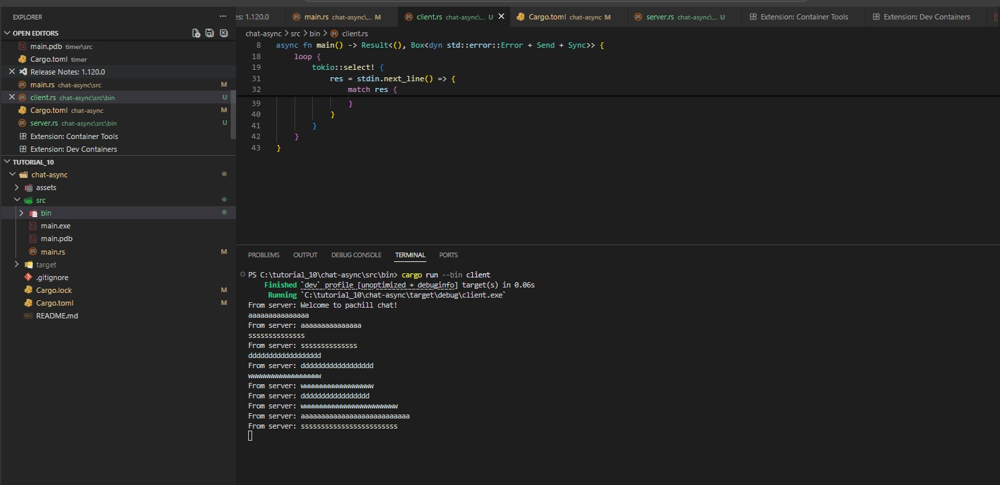
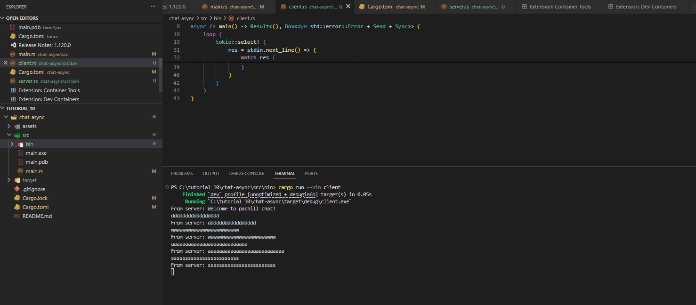

# Tutorial 10 — Async Timer with Custom Executor

## Experiment 1.2: Understanding how it works

### Penjelasan

Urutan output yang tercetak, yaitu `"hey hey"` lebih dulu, baru `"howdy!"`, lalu `"done!"`, terjadi karena cara kerja async di Rust yang bersifat *lazy*, dan ini sangat berkaitan erat dengan peran masing-masing dari `Spawner`, `Executor`, dan `drop`. Ketika `spawner.spawn(async { ... })` dipanggil, `Spawner` hanya bertugas membungkus future ke dalam sebuah `Task` lalu mengirimkannya ke dalam antrian channel tanpa menjalankan isi blok async tersebut sama sekali, sehingga `println!("Fathir's Komputer: hey hey")` yang ada setelahnya langsung dieksekusi secara sinkron di main thread dan menjadi output pertama yang muncul. Barulah setelah `drop(spawner)` dipanggil, sisi pengirim channel ditutup, yang menjadi sinyal penting bagi `Executor` bahwa tidak akan ada task baru lagi, sehingga `executor.run()` bisa berjalan dan mulai mem-*poll* task dari antrian. Saat itulah isi blok async dieksekusi: `"howdy!"` tercetak, lalu eksekusi mencapai `TimerFuture::new(Duration::new(2, 0)).await` yang mengembalikan `Poll::Pending` karena timer belum selesai, task pun ditangguhkan sementara thread latar belakang tidur 2 detik, dan setelah timer selesai, `waker.wake()` dipanggil untuk memasukkan kembali task ke antrian sehingga executor bisa melanjutkan dan mencetak `"done!"`. Hubungan ketiganya sangat erat: `Spawner` mengisi antrian, `drop(spawner)` menutup channel agar executor tahu kapan harus berhenti menunggu, dan `Executor` yang mengonsumsi serta menjalankan semua task dari antrian tersebut. Tanpa `drop(spawner)`, executor tidak pernah tahu bahwa tidak ada task baru lagi sehingga `executor.run()` akan terus menunggu selamanya di `ready_queue.recv()` dan program tidak pernah keluar meski semua output sudah tercetak.

---

## Experiment 1.3: Multiple spawns dan efek `drop(spawner)`

### Penjelasan

Pada percobaan ini ditambahkan dua `spawn` lagi sehingga total ada tiga task, dan `drop(spawner)` dikomentari untuk melihat efeknya. Ketiga task masuk ke antrian sebelum executor mulai berjalan, lalu executor memproses task satu per satu: task pertama mencetak `"howdy!"` kemudian mengembalikan `Poll::Pending` saat menunggu timer, sehingga executor langsung lanjut ke task kedua yang mencetak `"howdy2!"` dan juga pending, lalu task ketiga mencetak `"howdy3!"` dan pending juga. Karena setiap `TimerFuture` melakukan `thread::spawn` sendiri untuk timernya, ketiga timer berjalan bersamaan di thread latar belakang, dan setelah sekitar 2 detik ketiganya memanggil `waker.wake()` hampir bersamaan sehingga executor menyelesaikan ketiga task secara bergantian dan mencetak `"done!"`, `"done2!"`, dan `"done3!"`. Namun karena `drop(spawner)` tidak dipanggil, channel pengirim tidak pernah ditutup, dan `executor.run()` terus menunggu di `ready_queue.recv()` setelah semua task selesai, membuat program tidak pernah keluar dan terminal tampak menggantung. Inilah yang membuktikan bahwa `drop(spawner)` bukan sekadar pembersihan memori biasa, melainkan sinyal eksplisit yang menentukan kapan siklus kerja executor berakhir.

--- 

## Experiment 2.1: Original code, and how it runs

**Server:**

**Client 1:**

**Client 2:**

**Client 3:**

### Penjelasan

Ketika server dijalankan, ia mengikat TCP listener di `127.0.0.1:2000` dan membuat sebuah `broadcast::channel` yang menjadi jantung dari sistem ini, karena semua pesan yang diterima dari client mana pun akan dikirimkan ulang ke seluruh client yang terhubung melalui channel tersebut. Setiap kali ada client yang terkoneksi, server memanggil `tokio::spawn` untuk menjalankan fungsi `handle_connection` sebagai task async tersendiri, artinya ketiga client berjalan secara *concurrent* tanpa saling memblokir satu sama lain. Di dalam `handle_connection`, digunakan `tokio::select!` yang secara bersamaan mendengarkan dua sumber yaitu pesan masuk dari WebSocket client itu sendiri dan pesan dari `broadcast::Receiver` yang menerima siaran dari semua client lain, sehingga server bisa merespons keduanya tanpa harus memilih salah satu untuk ditunggu lebih dulu. Ketika client mengirim teks, server meneruskannya ke `broadcast::Sender`, yang kemudian mendistribusikan pesan tersebut ke semua subscriber termasuk client pengirimnya sendiri. Di sisi client, `tokio::select!` juga digunakan untuk secara bersamaan menunggu input dari stdin dan pesan masuk dari server, sehingga client bisa menerima pesan dari client lain sambil tetap bisa mengetik tanpa ada yang terblokir. Hasilnya, ketika salah satu client mengetik pesan, pesan tersebut muncul di semua terminal client lain dengan prefix `From server:`, yang merupakan perilaku broadcast chat yang sesungguhnya dan ini hanya bisa bekerja dengan mulus karena model async memungkinkan banyak operasi I/O berjalan secara *concurrent* dalam satu thread tanpa perlu membuat thread baru untuk setiap client.
