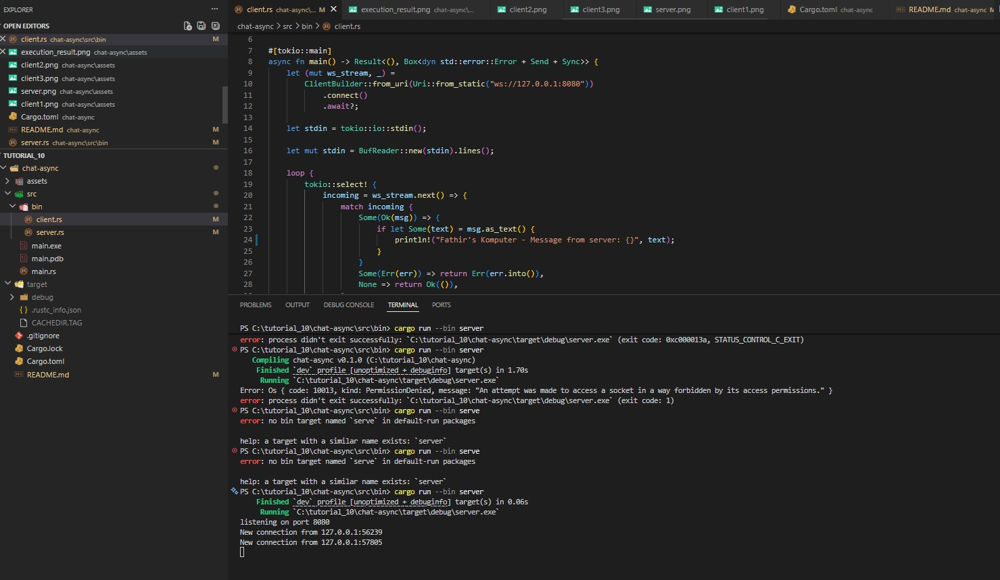
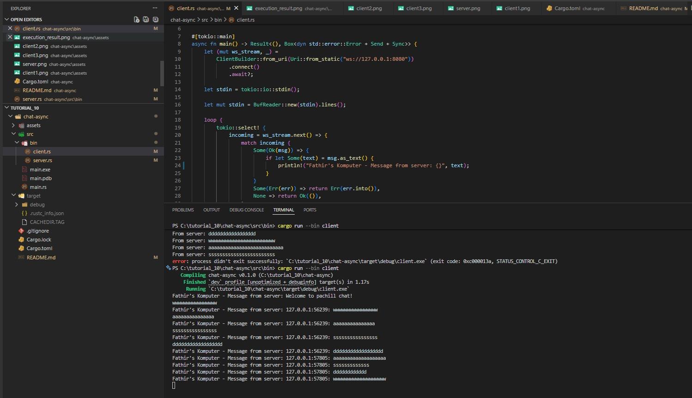
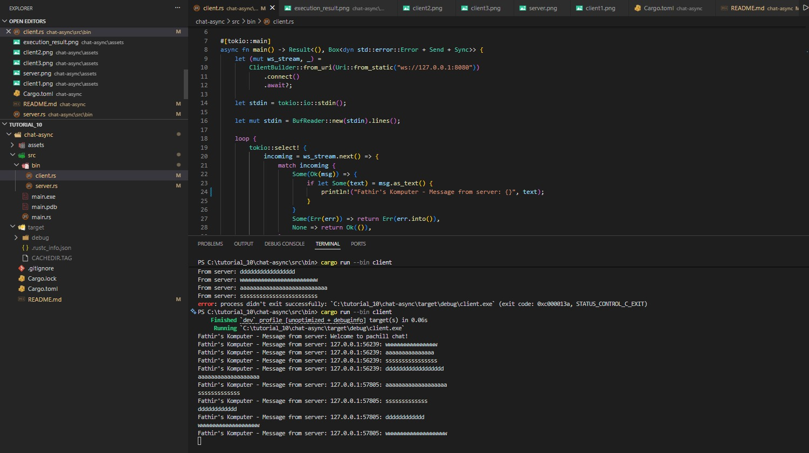
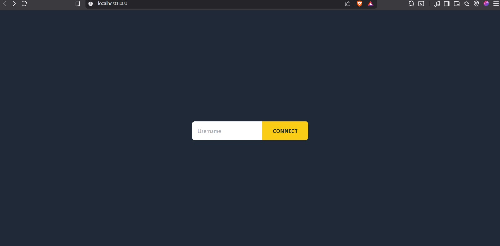
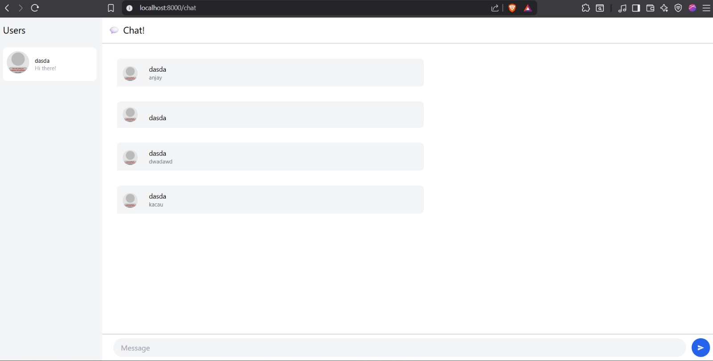
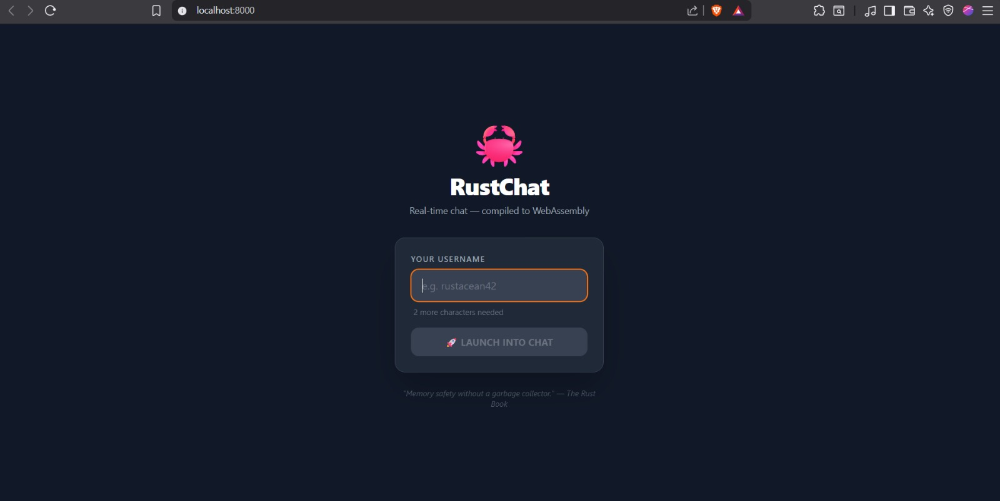
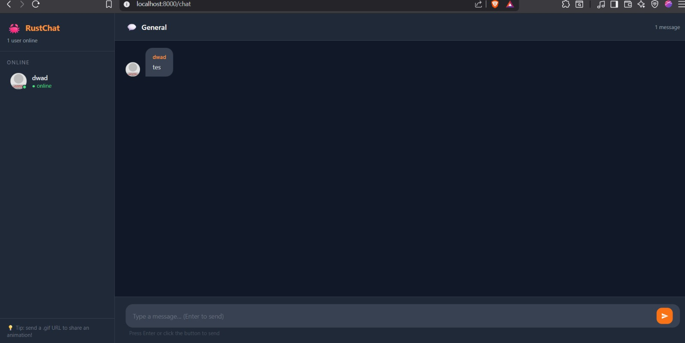
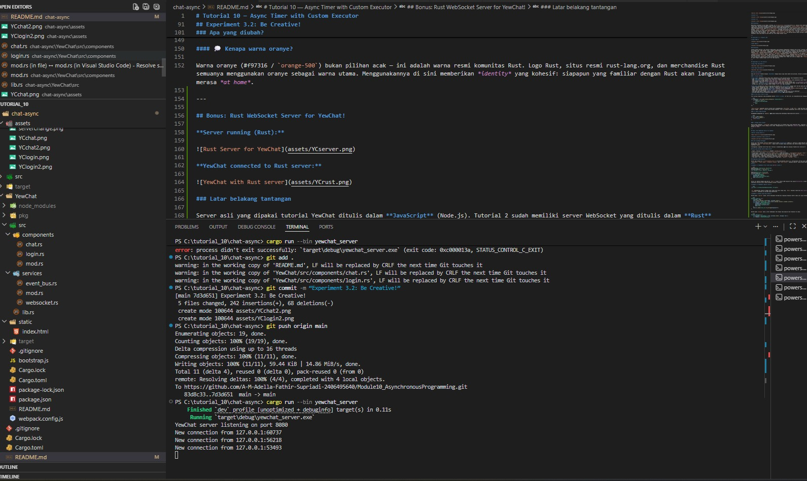
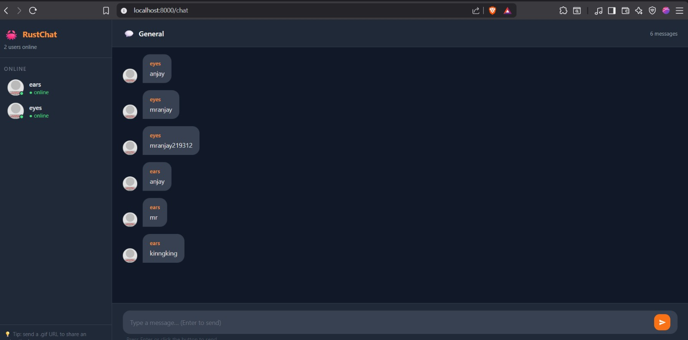

# Tutorial 10 — Async Timer with Custom Executor

## Experiment 1.2: Understanding how it works


### Penjelasan

Urutan output yang tercetak, yaitu `"hey hey"` lebih dulu, baru `"howdy!"`, lalu `"done!"`, terjadi karena cara kerja async di Rust yang bersifat *lazy*, dan ini sangat berkaitan erat dengan peran masing-masing dari `Spawner`, `Executor`, dan `drop`. Ketika `spawner.spawn(async { ... })` dipanggil, `Spawner` hanya bertugas membungkus future ke dalam sebuah `Task` lalu mengirimkannya ke dalam antrian channel tanpa menjalankan isi blok async tersebut sama sekali, sehingga `println!("Fathir's Komputer: hey hey")` yang ada setelahnya langsung dieksekusi secara sinkron di main thread dan menjadi output pertama yang muncul. Barulah setelah `drop(spawner)` dipanggil, sisi pengirim channel ditutup, yang menjadi sinyal penting bagi `Executor` bahwa tidak akan ada task baru lagi, sehingga `executor.run()` bisa berjalan dan mulai mem-*poll* task dari antrian. Saat itulah isi blok async dieksekusi: `"howdy!"` tercetak, lalu eksekusi mencapai `TimerFuture::new(Duration::new(2, 0)).await` yang mengembalikan `Poll::Pending` karena timer belum selesai, task pun ditangguhkan sementara thread latar belakang tidur 2 detik, dan setelah timer selesai, `waker.wake()` dipanggil untuk memasukkan kembali task ke antrian sehingga executor bisa melanjutkan dan mencetak `"done!"`. Hubungan ketiganya sangat erat: `Spawner` mengisi antrian, `drop(spawner)` menutup channel agar executor tahu kapan harus berhenti menunggu, dan `Executor` yang mengonsumsi serta menjalankan semua task dari antrian tersebut. Tanpa `drop(spawner)`, executor tidak pernah tahu bahwa tidak ada task baru lagi sehingga `executor.run()` akan terus menunggu selamanya di `ready_queue.recv()` dan program tidak pernah keluar meski semua output sudah tercetak.

---

## Experiment 1.3: Multiple spawns dan efek `drop(spawner)`


### Penjelasan

Pada percobaan ini ditambahkan dua `spawn` lagi sehingga total ada tiga task, dan `drop(spawner)` dikomentari untuk melihat efeknya. Ketiga task masuk ke antrian sebelum executor mulai berjalan, lalu executor memproses task satu per satu: task pertama mencetak `"howdy!"` kemudian mengembalikan `Poll::Pending` saat menunggu timer, sehingga executor langsung lanjut ke task kedua yang mencetak `"howdy2!"` dan juga pending, lalu task ketiga mencetak `"howdy3!"` dan pending juga. Karena setiap `TimerFuture` melakukan `thread::spawn` sendiri untuk timernya, ketiga timer berjalan bersamaan di thread latar belakang, dan setelah sekitar 2 detik ketiganya memanggil `waker.wake()` hampir bersamaan sehingga executor menyelesaikan ketiga task secara bergantian dan mencetak `"done!"`, `"done2!"`, dan `"done3!"`. Namun karena `drop(spawner)` tidak dipanggil, channel pengirim tidak pernah ditutup, dan `executor.run()` terus menunggu di `ready_queue.recv()` setelah semua task selesai, membuat program tidak pernah keluar dan terminal tampak menggantung. Inilah yang membuktikan bahwa `drop(spawner)` bukan sekadar pembersihan memori biasa, melainkan sinyal eksplisit yang menentukan kapan siklus kerja executor berakhir.

--- 

## Experiment 2.1: Original code, and how it runs

**Server:**


**Client 1:**


**Client 2:**


**Client 3:**


### Penjelasan

Ketika server dijalankan, ia mengikat TCP listener di `127.0.0.1:2000` dan membuat sebuah `broadcast::channel` yang menjadi jantung dari sistem ini, karena semua pesan yang diterima dari client mana pun akan dikirimkan ulang ke seluruh client yang terhubung melalui channel tersebut. Setiap kali ada client yang terkoneksi, server memanggil `tokio::spawn` untuk menjalankan fungsi `handle_connection` sebagai task async tersendiri, artinya ketiga client berjalan secara *concurrent* tanpa saling memblokir satu sama lain. Di dalam `handle_connection`, digunakan `tokio::select!` yang secara bersamaan mendengarkan dua sumber yaitu pesan masuk dari WebSocket client itu sendiri dan pesan dari `broadcast::Receiver` yang menerima siaran dari semua client lain, sehingga server bisa merespons keduanya tanpa harus memilih salah satu untuk ditunggu lebih dulu. Ketika client mengirim teks, server meneruskannya ke `broadcast::Sender`, yang kemudian mendistribusikan pesan tersebut ke semua subscriber termasuk client pengirimnya sendiri. Di sisi client, `tokio::select!` juga digunakan untuk secara bersamaan menunggu input dari stdin dan pesan masuk dari server, sehingga client bisa menerima pesan dari client lain sambil tetap bisa mengetik tanpa ada yang terblokir. Hasilnya, ketika salah satu client mengetik pesan, pesan tersebut muncul di semua terminal client lain dengan prefix `From server:`, yang merupakan perilaku broadcast chat yang sesungguhnya dan ini hanya bisa bekerja dengan mulus karena model async memungkinkan banyak operasi I/O berjalan secara *concurrent* dalam satu thread tanpa perlu membuat thread baru untuk setiap client.

---

## Experiment 2.2: Modifying port

### Penjelasan

Karena aplikasi ini berbasis koneksi client-server, mengubah port berarti harus mengubah di dua tempat sekaligus agar keduanya tetap sepakat. Di sisi server, port didefinisikan di [src/bin/server.rs](src/bin/server.rs) pada baris `TcpListener::bind("127.0.0.1:2000")`, yaitu alamat TCP yang didengarkan server untuk menerima koneksi masuk. Di sisi client, port didefinisikan di [src/bin/client.rs](src/bin/client.rs) pada baris `ClientBuilder::from_uri(Uri::from_static("ws://127.0.0.1:2000"))`, yaitu URI tujuan koneksi yang dibentuk client saat mencoba terhubung ke server. Keduanya diubah dari port `2000` menjadi `8080`. Perlu diperhatikan bahwa URI di client menggunakan skema `ws://`, yang merupakan protokol WebSocket, dan ini sudah sesuai dengan server yang menggunakan `tokio-websockets` dengan `ServerBuilder::new().accept(socket)` untuk melakukan WebSocket handshake di atas koneksi TCP biasa. Jadi protokol yang digunakan adalah WebSocket (layer aplikasi) di atas TCP (layer transport), dan kedua sisi harus menggunakan port yang sama agar koneksi berhasil terbentuk. Setelah perubahan port dilakukan di kedua file, aplikasi tetap berjalan normal persis seperti sebelumnya.

---

## Experiment 2.3: Small changes — adding sender information

**Server:**



**Client 1:**



**Client 2:**



### Penjelasan

Modifikasi dilakukan di dua tempat. Pertama, di [src/bin/server.rs](src/bin/server.rs), ketika server menerima pesan dari client, sebelum disiarkan ke semua client lain, teks pesan dibungkus dengan informasi alamat pengirim menggunakan `format!("{addr}: {text}")` sehingga broadcast yang dikirim ke seluruh subscriber sudah berisi IP dan port si pengirim. Selain itu, server juga mencetak log `println!("From client {addr} \"{text}\"")` di terminalnya sendiri agar mudah melacak siapa yang mengirim apa. Kedua, di [src/bin/client.rs](src/bin/client.rs), format tampilan pesan yang diterima dari server diubah dari `"From server: {text}"` menjadi `"Fathir's Komputer - From server: {text}"`, sehingga setiap pesan yang muncul di terminal client sudah mencantumkan nama komputer pemilik client tersebut diikuti isi pesan yang sudah mengandung IP:port pengirim aslinya dari server. Hasilnya, setiap kali ada client yang mengetik pesan, semua client lain akan melihat tampilan seperti `Fathir's Komputer - From server: 127.0.0.1:49838: halo`, di mana `127.0.0.1:49838` adalah identitas koneksi TCP si pengirim yang diambil server dari parameter `addr` pada fungsi `handle_connection`. Ini penting karena tanpa informasi sender, semua pesan terlihat anonim dan tidak bisa dibedakan siapa yang mengirim apa dalam sesi chat dengan banyak client.

---

## Experiment 3.1: Original code

**Login Page:**



**Chat Page:**



### Penjelasan

YewChat adalah aplikasi chat berbasis WebAssembly yang dibangun menggunakan framework Yew di Rust. Aplikasi ini terdiri dari dua komponen utama: halaman Login dan halaman Chat. Pada halaman Login, pengguna mengetikkan username (minimal 2 karakter) lalu menekan tombol Connect yang akan menyimpan username ke dalam global Context bertipe `Rc<UserInner>` menggunakan `RefCell` untuk interior mutability, kemudian me-route browser ke halaman Chat melalui `yew-router`. Di halaman Chat, komponen `Chat` langsung menginisialisasi `WebsocketService` yang membuka koneksi WebSocket ke `ws://127.0.0.1:8080` dan mengirim pesan registrasi berformat JSON `{"messageType":"register","data":"username"}` ke server. Komunikasi antara `WebsocketService` dan komponen `Chat` menggunakan dua mekanisme berbeda: pesan dari komponen ke server dikirim melalui MPSC channel (`futures::channel::mpsc`), sedangkan pesan dari server ke komponen diteruskan melalui `EventBus` yang merupakan Yew Agent berbasis `yew_agent`. Ketika server membalas dengan daftar pengguna bertipe `{"messageType":"users","dataArray":[...]}`, komponen memperbarui daftar user di panel kiri beserta avatar yang di-generate dari DiceBear API. Pesan chat dikirim sebagai JSON `{"messageType":"message","data":"teks"}` dan ditampilkan di panel tengah lengkap dengan avatar dan nama pengirim.

---

## Experiment 3.2: Be Creative!

**Login Page (RustChat):**



**Chat Page (RustChat):**



### Apa yang diubah?

Saya me-*rebrand* YewChat menjadi **RustChat** dengan desain yang lebih modern dan personal. Berikut perubahan yang dibuat:

#### 🎨 Visual Overhaul

**Login page** sebelumnya hanya kotak input sederhana di latar abu-abu gelap. Saya mengubahnya menjadi:
- Logo **🦀** (crab Ferris, maskot Rust) yang besar sebagai identitas visual
- Nama **RustChat** dengan tagline *"Real-time chat — compiled to WebAssembly"* untuk menekankan aspek teknis yang keren
- Input dengan border yang menyala oranye saat fokus (`focus:border-orange-500`)
- Hint dinamis: tampilkan *"2 more characters needed"* saat input kurang, berubah jadi *"✓ 5 characters — looking good!"* saat cukup
- Tombol **"🚀 Launch into Chat"** yang disabled dan abu-abu saat username belum cukup, berubah oranye saat siap
- Kutipan dari Rust Book di bagian bawah sebagai *easter egg* bagi programmer

**Chat page** berubah dari desain terang abu-abu menjadi full **dark theme** dengan palet abu-abu gelap dan aksen oranye (warna ikonik komunitas Rust):
- Header sidebar menampilkan logo + nama app + jumlah user online secara real-time
- Setiap user di sidebar memiliki **green dot** indikator online (menggunakan `border-2 border-gray-800` agar dot terlihat bersih di atas avatar)
- Bagian bawah sidebar menampilkan tip: *"send a .gif URL to share an animation!"*
- Header chat area menampilkan **jumlah pesan** yang terupdate otomatis
- Jika belum ada pesan, tampil *empty state* dengan 🦀 dan teks "Be the first to say something!"
- Username pengirim pesan ditampilkan dengan warna **oranye** agar mudah dibedakan

#### ⌨️ Fitur Baru: Enter to Send

Fitur paling fungsional yang ditambahkan adalah **Enter to send**. Di Yew 0.19, ini diimplementasikan menggunakan `batch_callback` pada event `onkeypress`:

```rust
let onkeypress = ctx.link().batch_callback(|e: KeyboardEvent| {
    if e.key() == "Enter" {
        Some(Msg::SubmitMessage)
    } else {
        None
    }
});
```

`batch_callback` digunakan karena callback perlu mengembalikan `Option<Msg>` — jika `None`, tidak ada pesan yang dikirim ke komponen. Ini lebih efisien daripada selalu trigger `update()` untuk setiap ketukan keyboard. Fitur ini membuat pengalaman chat terasa lebih natural.

#### 🛡️ Guard: Empty Message

Ditambahkan pengecekan di `update()` agar pesan kosong atau whitespace tidak dikirim ke server:

```rust
let val = input.value();
if val.trim().is_empty() {
    return false;
}
```

#### 💭 Kenapa warna oranye?

Warna oranye (#f97316 / `orange-500`) bukan pilihan acak — ini adalah warna resmi komunitas Rust. Logo Rust, situs resmi rust-lang.org, dan merchandise Rust semuanya menggunakan oranye sebagai warna utama. Menggunakannya di sini memberikan *identity* yang kohesif: siapapun yang familiar dengan Rust akan langsung merasa *at home*.

---

## Bonus: Rust WebSocket Server for YewChat!

**Server running (Rust):**



**YewChat connected to Rust server:**



### Latar belakang tantangan

Server asli yang dipakai tutorial YewChat ditulis dalam **JavaScript** (Node.js). Tutorial 2 sudah memiliki server WebSocket yang ditulis dalam **Rust** menggunakan `tokio` + `tokio-websockets`, namun server tersebut hanya meneruskan teks mentah dengan prefix alamat IP — tidak memahami protokol JSON yang digunakan YewChat.

Tantangannya: dapatkah server Rust dari Tutorial 2 dimodifikasi agar bisa melayani YewChat dari Tutorial 3?

### Apa yang berbeda antara kedua server?

| Aspek | Tutorial 2 (`server.rs`) | YewChat (`yewchat_server.rs`) |
|-------|--------------------------|-------------------------------|
| Format pesan | Teks bebas: `"127.0.0.1:49838: halo"` | JSON terstruktur: `{"messageType":"message","data":"..."}` |
| Identifikasi pengirim | Alamat IP:port dari TCP | Username yang didaftarkan via pesan `register` |
| Manajemen user | Tidak ada — hanya broadcast raw | `HashMap<SocketAddr, String>` terbungkus `Arc<Mutex>` |
| Saat disconnect | Tidak ada notifikasi | Broadcast daftar user terbaru ke semua client |
| Tipe pesan | Satu jenis (semua di-broadcast) | Tiga jenis: `register`, `message`, `users` |

### Bagaimana modifikasinya?

Server baru dibuat di [`src/bin/yewchat_server.rs`](src/bin/yewchat_server.rs). Infrastruktur TCP dan async dari Tutorial 2 dipertahankan sepenuhnya — `TcpListener`, `tokio::spawn`, `broadcast::channel`, dan `tokio::select!` semuanya identik. Yang berubah adalah **apa yang dilakukan server setelah menerima pesan**.

**Langkah 1 — Tambahkan struct serde yang *mirror* client:**

```rust
#[derive(Debug, Deserialize, Serialize)]
#[serde(rename_all = "lowercase")]
enum MsgTypes { Users, Register, Message }

#[derive(Deserialize, Serialize)]
#[serde(rename_all = "camelCase")]
struct WebSocketMessage {
    message_type: MsgTypes,
    data_array: Option<Vec<String>>,
    data: Option<String>,
}
```

Struct ini identik dengan yang ada di `chat.rs` client. Karena JSON hanyalah teks yang di-*serialize*, selama kedua sisi setuju pada struktur yang sama, komunikasi berjalan mulus tanpa perubahan protokol transport.

**Langkah 2 — Tambahkan registri user:**

```rust
type Users = Arc<Mutex<HashMap<SocketAddr, String>>>;
```

`Arc` memungkinkan registri dibagi antar semua task async tanpa copy, `Mutex` menjamin tidak ada *data race* saat dua koneksi masuk bersamaan. Setiap `SocketAddr` dipetakan ke username yang didaftarkan.

**Langkah 3 — Handle tiga jenis pesan:**

Ketika pesan `register` masuk, server menyimpan username dan langsung broadcast daftar semua user yang terhubung:

```rust
MsgTypes::Register => {
    username = name;
    users.lock().unwrap().insert(addr, username.clone());
    let user_list: Vec<String> = users.lock().unwrap().values().cloned().collect();
    let response = WebSocketMessage {
        message_type: MsgTypes::Users,
        data_array: Some(user_list),
        data: None,
    };
    bcast_tx.send(serde_json::to_string(&response)?)?;
}
```

Ketika pesan `message` masuk, server membungkus teks dengan nama pengirim dan broadcast ke semua:

```rust
MsgTypes::Message => {
    let msg_data = MessageData { from: username.clone(), message: text };
    let response = WebSocketMessage {
        message_type: MsgTypes::Message,
        data: Some(serde_json::to_string(&msg_data)?),
        data_array: None,
    };
    bcast_tx.send(serde_json::to_string(&response)?)?;
}
```

**Langkah 4 — Cleanup saat disconnect:**

```rust
users.lock().unwrap().remove(&addr);
// broadcast users list yang sudah dikurangi
```

### Mengapa ini berhasil?

Kunci keberhasilannya adalah memahami bahwa **WebSocket pada dasarnya hanyalah transport teks**. YewChat client mengirim JSON sebagai string teks biasa, dan server hanya perlu tahu cara mem-*parse* string itu. Karena `tokio-websockets` sudah menangani framing WebSocket, perubahan yang diperlukan hanya di lapisan aplikasi — bagaimana server menginterpretasikan isi teks yang diterima.

`serde_json::from_str()` dan `serde_json::to_string()` menjembatani dua dunia: string teks yang melewati WebSocket di satu sisi, dan struct Rust yang ter-*type-check* di sisi lain. Selama format JSON antara client dan server konsisten (diatur oleh annotation `#[serde(rename_all = "camelCase")]` dan `#[serde(rename_all = "lowercase")]`), tidak ada yang perlu diubah di layer transport sama sekali.

### Mana yang lebih saya sukai: JavaScript atau Rust?

**Saya lebih memilih server Rust**, dan berikut alasannya:

**1. Type safety end-to-end.** Di server JavaScript, tipe pesan yang diterima adalah `any` — compiler tidak bisa menangkap kesalahan format JSON di *compile time*. Di Rust, jika client mengirim JSON dengan field yang salah, `serde_json::from_str()` gagal dengan error yang bisa di-*handle* secara eksplisit. Tidak ada kejutan di runtime.

**2. Concurrency yang jelas.** JavaScript server bisa saja menggunakan shared mutable state dengan tidak aman karena Node.js single-threaded. Di Rust, `Arc<Mutex<HashMap>>` memaksa programmer berpikir tentang thread safety — dan *compiler* yang memastikannya, bukan disiplin programmer.

**3. Performa.** Rust tidak memiliki garbage collector. Server Rust bisa melayani ribuan koneksi concurrent dengan latensi yang lebih konsisten karena tidak ada GC pause. Untuk aplikasi chat real-time, latensi yang konsisten lebih penting daripada throughput puncak.

**4. Satu bahasa untuk segalanya.** Dengan Rust di server dan Yew (Rust) di client, seluruh stack menggunakan satu bahasa. Struct `WebSocketMessage` yang sama bisa secara teori di-*share* sebagai library. Di ekosistem JS, client TypeScript dan server JS masih dua ekosistem berbeda dengan tooling berbeda.

**Kekurangan Rust:** waktu kompilasi lebih lama, dan kurva belajar jauh lebih curam. Untuk prototipe cepat atau tim yang sudah mahir JavaScript, server JS tetap pilihan yang sangat praktis. Namun untuk sistem produksi yang mengutamakan keandalan dan keamanan — Rust adalah pilihan yang tepat.
